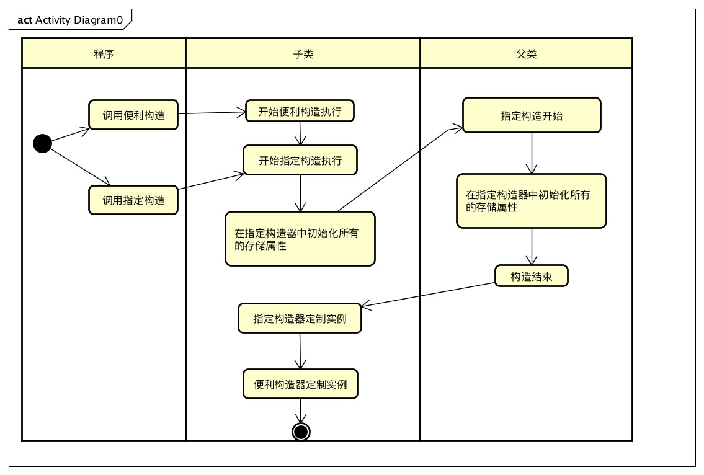

layout: post
title: swift学习小知识点(一)
comment: true
tags: [swift,小知识]
date: 2017-02-27 15:10:02
updated: 2017-02-27 15:10:02
---
上周花了时间去学习了swift，虽然自己是搞IOS开发但是之前并没有接触过这门新生语言。通过文章总结一下自己学习到的重要知识点，算是回顾一下。
<!--more-->
>*构造过程定义:构造过程是使用类、结构体或枚举类型的实例之前的准备过程。在新实例可用前必须执行这个过程，具体操作包括设置实例中每个`存储型属性`的初始值和执行其他必须的设置或初始化工作*

两段构造过程：

>下图中是存在一层继承关系的构造调用过程

