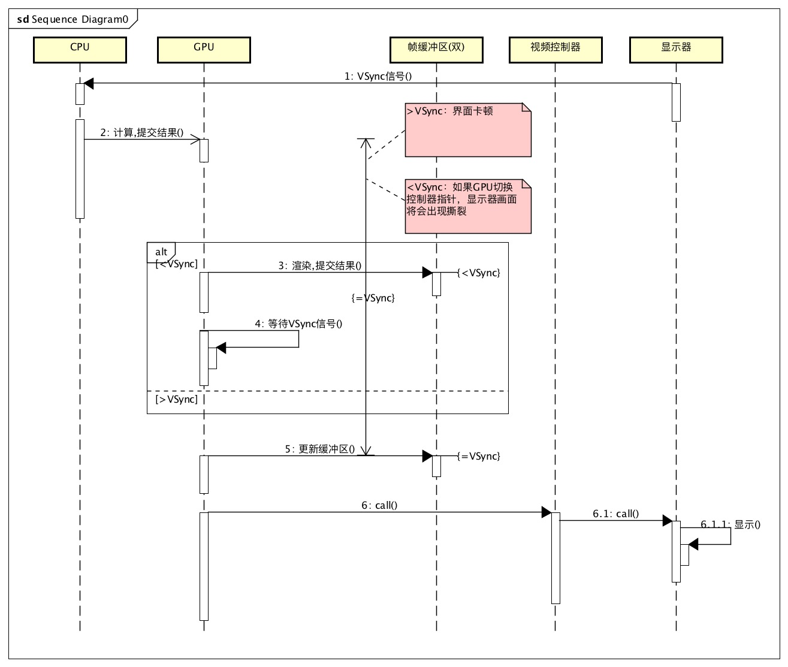

layout: post
title: 界面流畅优化
comment: true
tags: []
date: 2017-03-08 16:10:49
updated: 2017-03-08 16:10:49
---

>App的开发中,界面的流畅度是非常重要的。它决定到用户对产品体验的好感。在IOS开发中容易出现界面体验不好的地方是tableView列表。你是否想过为什么自己写的列表那么不流畅？是什么影响了它的流畅度？当你的APP启动渲染界面时需要经过大量的计算尤其是比较复杂的列表。这样的过程很耗时，那么就会引起界面不流畅。
<!--more-->

视图从创建到渲染到屏幕显示的过程大致可以通过下面的时序描述出来。

>注:以上的时序是我通过[这篇连接](http://blog.ibireme.com/2015/11/12/smooth_user_interfaces_for_ios/)总结出来的，如果有错误欢迎指正。
