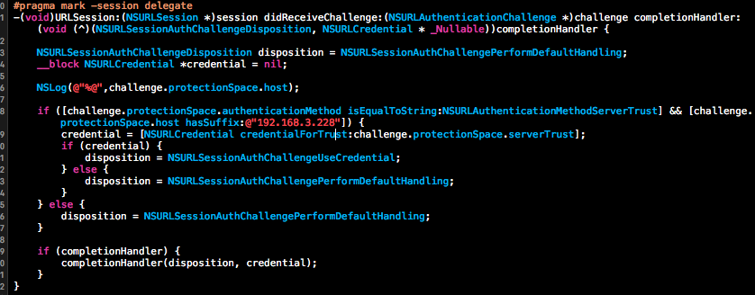

>昨天晚上在测试认证服务的时候暂时解决了一个问题,数据服务用的请求是http,但是认证请求是https。苹果本来就推荐用https来与服务器连接。现在是为了满足开发的需要通过改配置文件来真对请求是http的场景。
<!--more-->

*问题：认证的方式是通过https://ip:port方式发请求的，在运行中出现crash,原因是Error Domain=NSURLErrorDomain Code=-1202 "The certificate for this server is invalid. You might be connecting to a server that is pretending to be “xxx.xxx.xxx.xxx” which could put your confidential information at risk."。*

>通过查资料通过以上方式暂时解决了这个问题(我发的请求采用的NSURLSession请求，通过设置代理)。