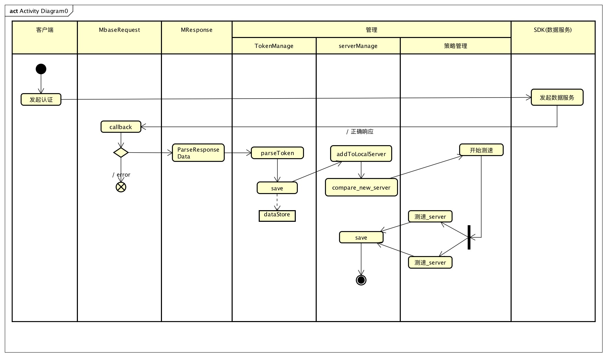
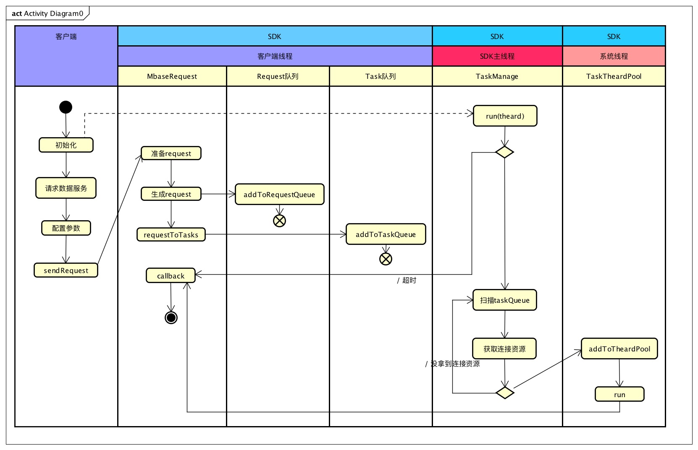

>马上就要过年了，项目差不多快结束了，这几个月在工作中遇到了很多问题，同时这些问题也磨砺了我。这个项目是一个关于网络请求的框架，里面有很多设计元素，也有很多自己平时需要多注意的地方，感觉自己有必要记录下来。通过这篇文章一方面回顾一下框架内容,再一个有些缺陷可以在这时候清晰的暴露出来。
<!--more-->

*框架大体上分为认证模块与数据服务模块。认证模块中的一些策略是这个模块的主要部分;数据服务中会有一些编程的思想以及一些设计元素，这些内容会影响着框架的健壮性、扩展性等诸多方面。*

* [认证模块](#认证模块)
* [数据服务模块](#数据服务模块)

>框架有几方面的特点：

* 框架整体在编写之前通过面向接口设计(保持平台一致性、更容易理解系统子模块之间的业务关系)。
* 数据结构方面由常见的key-value键值对设计为只有value的结构模型(节省流量带宽)。
* 数据都通过gzip压缩处理。
* 采用系统库进行编码开发(可维护性强、减小包的大小)。
* 在安全性方面认证流程采用https的形式请求资源服务。
* 真对数据请求接口会同时有n个连接去请求服务器，connectManage(连接管理)会采用同步的方式，以此来减小服务器的压力(n的大小通过task队列管理)。

>框架其它缺陷:

* 数据服务请求通过http的方式进行，请求中携带的token或会话id等信息是明文的。(设计缺陷)
* 编码过程中用到很多递归锁有些地方存在滥用的情况。(编码缺陷)
* 框架在长时间运行过程中会有一些内存没释放，虽然通过性能工具instrument分析过但是还会出现。(性能)

认证模块
------
>认证工作流

>在认证流程中几个管理类中会遇到一些策略和技术点:tokenManage和serverManage中的容器安全性(针对不同线程之间的出现的临界点)、策略管理中对认证返回的服务器列表进行测速处理.

数据服务模块
------
>数据服务模块工作流
